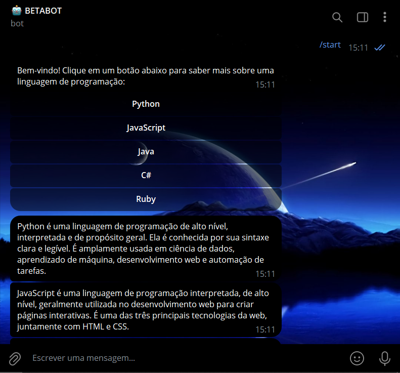
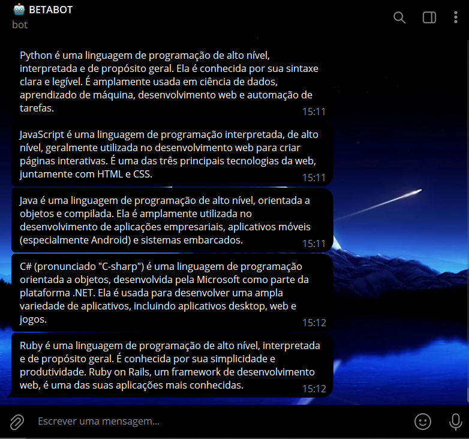

# COMANDOS INLINES
🤤ESSE É UM BOT DO TELEGRAM DE BOTÕES INLINES SOBRE LINGUAGENS DE PROGRAMAÇÃO COM TELEGRAF (NODEJS/JS)!

 <br>
 <br>

## DESCRIÇÃO:
Este bot do Telegram é projetado para fornecer informações sobre diferentes linguagens de programação através de botões inline. Quando um usuário clica em um botão, o bot responde com uma breve descrição da linguagem de programação selecionada.

## FUNCIONALIDADES:
1. **Comando /start**:
   - Inicia o bot e envia uma mensagem de boas-vindas ao usuário.
   - Exibe botões inline para diferentes linguagens de programação.

2. **Botões Inline**:
   - **Python**: Envia uma mensagem com informações sobre Python.
   - **JavaScript**: Envia uma mensagem com informações sobre JavaScript.
   - **Java**: Envia uma mensagem com informações sobre Java.
   - **C#**: Envia uma mensagem com informações sobre C#.
   - **Ruby**: Envia uma mensagem com informações sobre Ruby.

## EXECUTANDO O PROJETO:
1. **Editar o código:**
   - Certifique-se de substituir "seu_token_aqui" pelas informações corretas das suas credenciais em `CODIGO/.env`.

2. **Instalando as Depêndencias:**
   - Para instalar as dependências listadas no arquivo "package.json", você pode usar o comando `npm install` no terminal. Certifique-se de estar no diretório do seu projeto onde o arquivo "package.json" está localizado (`CODIGO`). O npm irá ler o arquivo "package.json" e instalar todas as dependências listadas nele. 

   ```bash
   npm install
   ```

3. **Inicie o Bot:**
   - Execute o bot do Telegram iniciando-o com o seguinte comando:
    ```bash
    npm start
    ```

4. **Interagindo com o Bot:**
   - Abra o Telegram, procure pelo seu bot e envie o comando `/start`.
   - Clique nos botões inline para ver as informações sobre as linguagens de programação.

## NÃO SABE?
- Entendemos que para manipular arquivos em muitas linguagens e tecnologias relacionadas, é necessário possuir conhecimento nessas áreas. Para auxiliar nesse aprendizado, oferecemos cursos gratuitos disponíveis:
* [CURSO DE TELEGRAF](https://github.com/VILHALVA/CURSO-DE-TELEGRAF)
* [CURSO DE JAVASCRIPT](https://github.com/VILHALVA/CURSO-DE-JAVASCRIPT)
* [CURSO DE NODEJS](https://github.com/VILHALVA/CURSO-DE-NODEJS)
* [CONFIRA MAIS CURSOS](https://github.com/VILHALVA?tab=repositories&q=+topic:CURSO)

## CREDITOS:
- [PROJETO CRIADO PELO VILHALVA](https://github.com/VILHALVA)

